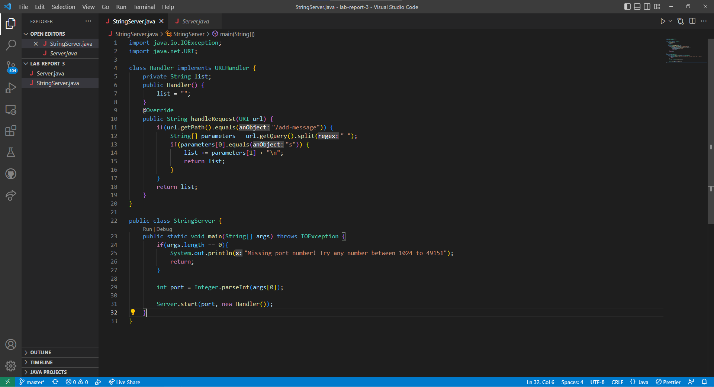
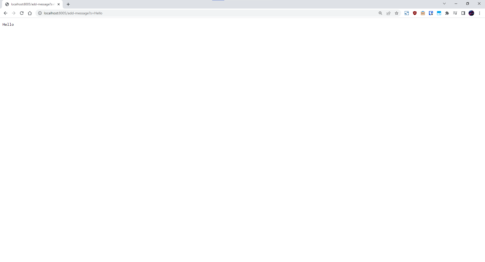
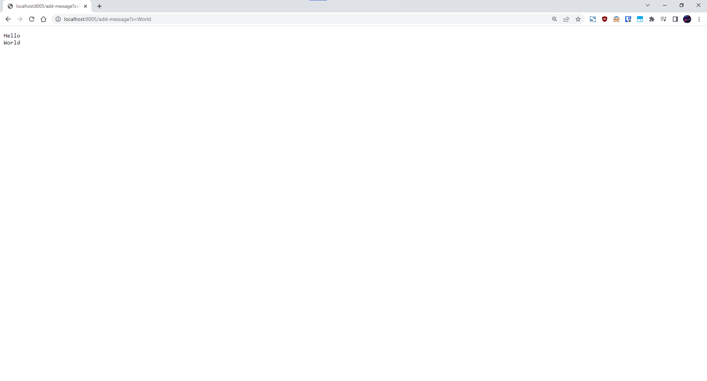

# Servers and Bugs  
## Part 1: StringServer   
This is my code for StringServer:  
  
  
  
This is the page that pops up when I run StringServer with different queries:  
  
After /add-message?s=Hello    

  

- First, the main method is called which calls Server.start(port, new Handler()) and starts the server. Then, when I search localhost:8005/add-message?s=Hello, handleRequest is called. In this method, url.getPath() is called and is compared to "/add-message". Then, url.getQuery() is called and .split("=") is called on the returned string. Finally, the first element in the returned string array is compared to "s" through .equals("s"), and the second value is added to the existing string with an additional escape character and returned. 
- Initially, the main method is called with "8005" as an argument to set up the server. Then, "localhost:8005/add-message?s=Hello" is passed into the handleRequest method. In the Handler class, the list field is initialized to "". After the path and query are compared to the expected values, the list field becomes "Hello\n" and is returned. 
- With this request, the main value that was changed was the private field list from the Handler class, which changed from "" to "Hello\n". 

After the previous query and /add-message?s=World    
  
  
  
- handleRequest is called. In this method, .getPath() is called on url and the returned string is compared with "/add-message" using .equals. Then, .getQuery() is called on url and .split("=") is called on the returned string. From there, the first parameter is compared with "s" using the .equals method, and the second parameter is appended to the list field with an additional escape character. 
- The list field is "Hello\n" from the previous query. handleRequest is called with the argument "localhost:8005/add-message?s=World". After the method compares the path and query, "World\n" is appended to list and list is returned. list becomes "Hello\nWorld\n".  
- With this request, the main value that was changed from the previous query was the private field list from the Handler class, which changed from "Hello\n" to "Hello\nWorld\n".  

## Part 2: Bugs  
  
Bugs in averageWithoutLowest from ArrayExamples  

Input that causes a failure:  
```
@Test  
public void testAverageWithoutLowest() {  
    double[] arr = {1, 1, 1, 5, 9};   
    assertEquals(4.0, ArrayExamples.averageWithoutLowest(arr), 0);  
}
```  
  
Input that doesn't cause a failure:  
```
@Test  
public void testAverageWithoutLowest() {  
    double[] arr = {1, 2, 3, 5, 9};   
    assertEquals(4.0, ArrayExamples.averageWithoutLowest(arr), 0);  
}  
```  

## Part 3: Reflection  
  
I learned about how servers handle queries as well as the components of a URI. I also learned about various testing concepts such as the definitions of symptoms vs. bugs. I never conceptualized the difference between the two terms and how the same symptom might be caused by multiple bugs or how one bug can cause multiple symptoms.   
